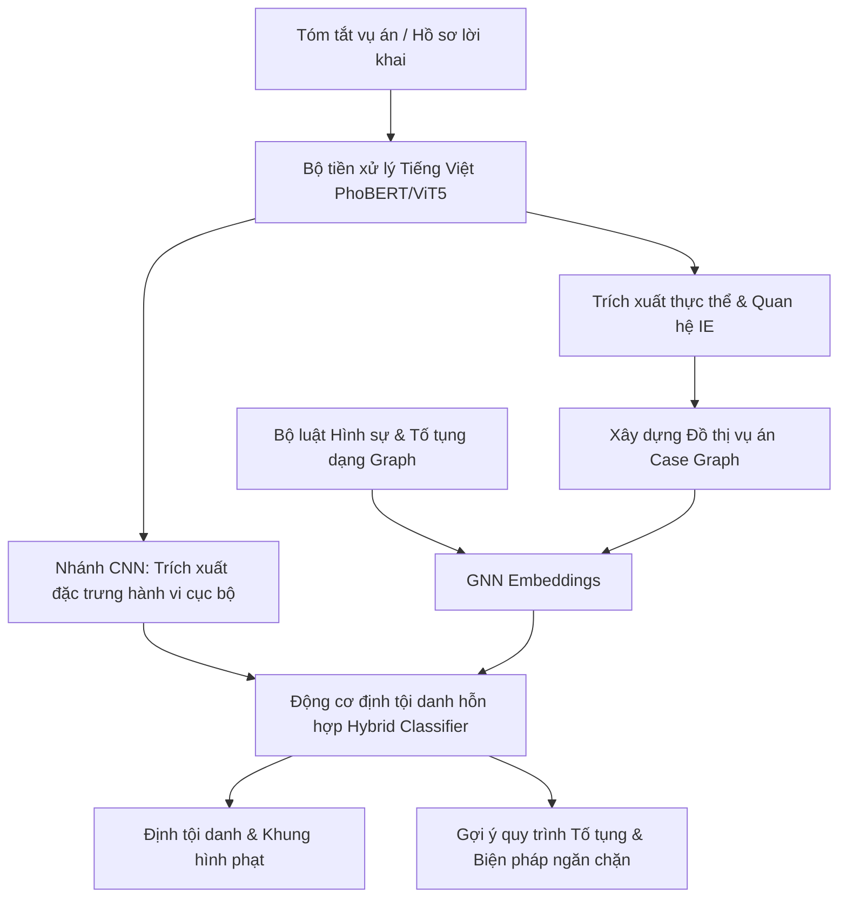

# Kế Hoạch Đề Xuất Cải Tiến Hệ Thống Định Tội Danh & Tố Tụng Hình Sự Thông Minh

Tài liệu này đề xuất phương án cải tiến công cụ **Đối chiếu & Đề xuất định tội** (Legal Match Engine) hiện tại của phần mềm **Investigation Assistant**. Kế hoạch tập trung chuyển đổi từ cơ chế trích lọc từ khóa tĩnh (Keyword-based Filtering) sang các mô hình Học sâu (Deep Learning) sử dụng **Mạng Nơ-ron Đồ thị (GNN)** và **Mạng Nơ-ron Tích chập (CNN)**, kết hợp tối ưu hóa quy trình Tố tụng Hình sự thông minh.

---

## 1. Đánh Giá Hiện Trạng & Hạn Chế Của Phương Pháp Từ Khóa

Hiện tại, module [matching_engine.py](file:///Users/quochuy/QH_Code/Software/Investigation_Assistant/app/services/matching_engine.py) và [legal.py](file:///Users/quochuy/QH_Code/Software/Investigation_Assistant/app/services/legal.py) đang sử dụng phương pháp **so khớp chuỗi từ khóa (Keyword Substring Matching)** để liên kết nội dung tóm tắt vụ việc (`summary_acts`) với danh mục từ khóa của điều luật (`keywords` trong [bo_luat_hinh_su_2015.json](file:///Users/quochuy/QH_Code/Software/Investigation_Assistant/app/data/bo_luat_hinh_su_2015.json)):

```python
# Trích đoạn giải thuật hiện tại trong matching_engine.py
matched_kws = [
    kw for kw in article.get("keywords", [])
    if kw.lower() in summary_lower
]
```

### Điểm yếu cốt lõi:
1. **Mất ngữ cảnh và ngữ nghĩa phức tạp:** Từ khóa đứng riêng lẻ không thể hiện được cấu trúc ngữ nghĩa hoặc ý chí của hành vi. Ví dụ, câu *"Bị can đe dọa sẽ tố cáo nạn nhân ngoại tình để đòi 50 triệu"* cấu thành tội **Cưỡng đoạt tài sản (Điều 170)**, nhưng nếu chỉ quét từ khóa "tố cáo", "ngoại tình" sẽ dễ bị bỏ sót hoặc định tội sai.
2. **Không giải quyết được hiện tượng đồng nghĩa/biến thể văn cảnh:** Tiếng Việt pháp lý rất phong phú. Kẻ phạm tội có thể "cuỗm", "khoắng", "lấy trộm", "nẫng", "chiếm đoạt" tài sản. Việc định nghĩa thủ công tất cả các từ khóa là bất khả thi và dễ bỏ sót.
3. **Bỏ sót cấu thành tội phạm:** Định tội danh yêu cầu đánh giá đầy đủ 4 yếu tố cấu thành: *Chủ thể, Khách thể, Mặt chủ quan, Mặt khách quan*. Cơ chế từ khóa chỉ so khớp bề mặt chữ mà hoàn toàn bỏ qua các mối quan hệ logic này.

---

## 2. Kiến Trúc Cải Tiến Đề Xuất (Deep Learning Framework)

Để giải quyết triệt để các hạn chế trên, chúng tôi đề xuất cấu trúc phân tầng kết hợp giữa **CNN** (xử lý văn bản cục bộ) và **GNN** (xử lý mối quan hệ cấu thành tội phạm và chuỗi tố tụng).



### 2.1. Nhánh 1: Mạng Nơ-ron Tích Chập (CNN) - Phân loại Hành vi Cục bộ (Semantic Text Tagging)
* **Ý tưởng:** Áp dụng CNN cho xử lý ngôn ngữ tự nhiên (TextCNN). CNN rất mạnh trong việc phát hiện các đặc trưng cục bộ (n-gram đặc trưng) của các cụm từ hành vi mà không phụ thuộc vào vị trí của chúng trong văn bản.
* **Cách thức hoạt động:**
  1. Sử dụng một mô hình ngôn ngữ Tiếng Việt tiền huấn luyện (như **PhoBERT** hoặc **ViDeBERTa**) làm lớp Embedding để chuyển các từ trong tóm tắt vụ việc thành các vector ngữ nghĩa chất lượng cao.
  2. Lớp **CNN 1D** với các kích thước kernel khác nhau (ví dụ: 3, 4, 5 từ) sẽ trượt qua văn bản để nhận diện các mô hình hành vi quan trọng (như *"dùng dao khống chế"*, *"lén lút đột nhập"*, *"chuyển tiền vào tài khoản lạ"*).
  3. Lớp Max-Pooling giữ lại các đặc trưng hành vi có trọng số lớn nhất để đưa vào bộ phân loại đa nhãn (Multi-label Classifier), dự đoán các Điều luật hình sự có khả năng bị vi phạm cao nhất.

### 2.2. Nhánh 2: Mạng Nơ-ron Đồ thị (GNN) - Đối chiếu Cấu thành Tội phạm
Đây là đột phá chính giúp mô hình hóa tri thức luật pháp một cách chặt chẽ và có khả năng giải thích cao (Explainable AI).

#### Bước 1: Xây dựng Đồ thị Tri thức Vụ án (Case Knowledge Graph)
Sử dụng công cụ trích xuất thực thể (NER) và quan hệ (Relation Extraction) để chuyển đổi hồ sơ vụ án thành một đồ thị hướng đối tượng:
* **Nút (Nodes):**
  * `Suspect` (Bị can: tuổi, giới tính, tiền án, tiền sự).
  * `Victim` (Bị hại).
  * `Asset` (Tài sản chiếm đoạt/hủy hoại: loại tài sản, giá trị).
  * `Weapon/Tool` (Công cụ, phương tiện: dao, súng, xe máy).
  * `Action` (Hành vi: đe dọa, lén lút, giả mạo, hành hung).
* **Cạnh (Edges - Quan hệ):**
  * `(Suspect) -[THỰC_HIỆN]-> (Action)`
  * `(Action) -[TÁC_ĐỘNG_LÊN]-> (Victim)`
  * `(Action) -[SỬ_DỤNG]-> (Weapon)`
  * `(Action) -[CHIẾM_ĐOẠT]-> (Asset)`

#### Bước 2: Xây dựng Đồ thị Luật pháp (Legal Ontology Graph)
Mô hình hóa Bộ luật Hình sự thành đồ thị cấu thành tội phạm chuẩn:
* Nút Điều luật (ví dụ: *Điều 168 - Tội cướp tài sản*) liên kết với các nút điều kiện cấu thành:
  * `[Hành vi cấu thành]`: Dùng vũ lực, đe dọa dùng vũ lực ngay tức khắc, hoặc hành vi khác làm cho người bị tấn công lâm vào tình trạng không thể chống cự được.
  * `[Mục đích]`: Nhằm chiếm đoạt tài sản.

#### Bước 3: So khớp Đồ thị bằng GNN (Graph Neural Network)
* Sử dụng mạng **Graph Attention Network (GAT)** hoặc **Graph Convolutional Network (GCN)** để học biểu diễn không gian (Embeddings) của Đồ thị vụ án và Đồ thị luật pháp.
* **Định tội danh (Criminal Charge Prediction):** Chuyển đổi thành bài toán **Dự đoán liên kết (Link Prediction)** giữa nút `Suspect` trên Đồ thị vụ án và nút `Điều luật` trên Đồ thị luật pháp. Nếu GNN dự đoán có liên kết mạnh giữa `Bị can A` và `Điều 173`, hệ thống sẽ đưa ra đề xuất.
* **Tính năng giải thích (Interpretability):** Hệ thống có thể chỉ ra đường dẫn liên kết (paths) dẫn tới quyết định định tội (ví dụ: `Bị can A` -> `Hành vi: Lén lút` -> `Tài sản: Xe máy` -> Khớp với cấu thành của `Điều 173: Trộm cắp tài sản`).

---

## 3. Quy Trình Tố Tụng Hình Sự Thông Minh (Smart Criminal Procedure)

Hiện tại phần mềm mới chỉ tập trung vào Bộ luật Hình sự (BLHS). Để cải tiến quy trình tố tụng hình sự dựa trên **Bộ luật Tố tụng Hình sự 2015 (BLTTHS)**, hệ thống sẽ được nâng cấp các module thông minh sau:

1. **Đồ thị Trạng thái Tố tụng (State-Machine Workflow):**
   Mô hình hóa toàn bộ vòng đời vụ án tố tụng: `Tin báo tố giác` $\rightarrow$ `Giải quyết tin báo` $\rightarrow$ `Khởi tố vụ án` $\rightarrow$ `Khởi tố bị can` $\rightarrow$ `Điều tra` $\rightarrow$ `Truy tố` $\rightarrow$ `Xét xử`.
2. **Cảnh báo sớm Thời hạn Tố tụng (Smart Deadline Alerts):**
   * GNN phân tích mức độ nghiêm trọng của tội danh được đề xuất (ví dụ: Tội đặc biệt nghiêm trọng có thời hạn tạm giam để điều tra khác với tội ít nghiêm trọng).
   * Hệ thống tự động tính toán thời hạn tối đa cho từng giai đoạn và gửi thông báo nhắc nhở (ví dụ: sắp hết hạn 07 ngày phê chuẩn quyết định khởi tố bị can).
3. **Gợi ý Biện pháp Ngăn chặn & Thủ tục Tương ứng:**
   * Dựa trên các thuộc tính của Bị can (Địa chỉ cư trú rõ ràng, tiền án tiền sự, mức độ nguy hiểm của hành vi), hệ thống gợi ý áp dụng biện pháp ngăn chặn phù hợp (ví dụ: *Tạm giam* thay vì *Cấm đi khỏi nơi cư trú* theo quy định tại Điều 119 BLTTHS).

---

## 4. Kế Hoạch Triển Khai Chi Tiết

Kế hoạch phát triển và cải tiến hệ thống được chia làm 3 giai đoạn:

### Giai đoạn 1: Chuẩn bị Dữ liệu & Xây dựng Đồ thị (Tháng 1 - Tháng 2)
* **Tác vụ 1:** Thiết kế cấu trúc đồ thị luật pháp (Legal Knowledge Graph Schema) cho các tội danh xâm phạm sở hữu (Điều 168 - Điều 180) và các tội phạm về chức vụ (Điều 353 - Điều 366).
* **Tác vụ 2:** Gán nhãn bộ dữ liệu huấn luyện (Custom Dataset): Thu thập và làm sạch khoảng 1,000 - 2,000 bản án hình sự thực tế từ Cổng thông tin công bố bản án của Tòa án, gán nhãn thực thể và quan hệ.
* **Tác vụ 3:** Phát triển bộ tiền xử lý NLP Tiếng Việt chuyên sâu cho văn bản pháp lý.

### Giai đoạn 2: Phát triển và Huấn luyện Mô hình Học sâu (Tháng 3 - Tháng 4)
* **Tác vụ 1:** Xây dựng mô hình TextCNN để phân loại thô điều luật từ tóm tắt vụ việc.
* **Tác vụ 2:** Thiết kế kiến trúc GAT/GCN để học biểu diễn đồ thị vụ án và thực hiện so khớp cấu thành tội phạm.
* **Tác vụ 3:** Tích hợp logic xử lý luật của BLTTHS vào công cụ lập lịch theo dõi tiến độ tố tụng hình sự.

### Giai đoạn 3: Tích hợp Hệ thống & Đánh giá (Tháng 5)
* **Tác vụ 1:** Đóng gói mô hình học sâu thành các API Backend (sử dụng FastAPI + PyTorch/DGL).
* **Tác vụ 2:** Cập nhật UI frontend tại [LegalMatch.tsx](file:///Users/quochuy/QH_Code/Software/Investigation_Assistant/frontend/src/views/LegalMatch.tsx) để hiển thị sơ đồ đồ thị so khớp (Visual Graph Matcher) và giải thích lý do định tội danh trực quan.
* **Tác vụ 3:** Đánh giá hiệu năng bằng các chỉ số: F1-score định tội danh, độ chính xác gợi ý điều khoản tố tụng và thời gian đáp ứng hệ thống.

---

## 5. Đánh Giá Khả Thi & Rủi Ro (Feasibility & Risks)

> [!WARNING]
> **Rủi ro 1: Thiếu dữ liệu huấn luyện chất lượng cao (Data Scarcity)**
> * *Mô tả:* Mô hình học sâu (đặc biệt là GNN) đòi hỏi lượng lớn dữ liệu quan hệ được gán nhãn chính xác bởi các chuyên gia pháp lý.
> * *Giải pháp giảm thiểu:* Sử dụng phương pháp **Học chuyển vị (Transfer Learning)** từ các mô hình ngôn ngữ lớn đã huấn luyện sẵn (PhoBERT) và áp dụng kỹ thuật **Tăng cường dữ liệu (Data Augmentation)** bằng cách thay đổi các tham số định lượng (số tiền chiếm đoạt, công cụ thực hiện) trên các kịch bản vụ án mẫu.

> [!IMPORTANT]
> **Rủi ro 2: Khó giải thích (Black-box Model)**
> * *Mô tả:* Các điều tra viên và kiểm sát viên yêu cầu tính pháp lý và giải thích rõ ràng căn cứ định tội danh, không thể chấp nhận kết quả từ một mô hình học sâu mập mờ.
> * *Giải pháp giảm thiểu:* Thiết kế cơ chế **Explainable AI (XAI)** trên GNN bằng cách trực quan hóa các đường dẫn kết nối thực thể (Path-based explanation) và hiển thị tỷ lệ đóng góp (Attention weights) của các tình tiết đối với quyết định gợi ý tội danh.

---

## 6. Đề Xuất Phản Hồi Từ Người Dùng (Open Questions)

Để hoàn thiện bản kế hoạch và chuẩn bị các bước tiếp theo, xin vui lòng cho ý kiến về các điểm sau:
1. **Phạm vi mô hình hóa:** Chúng ta nên ưu tiên huấn luyện mô hình cho nhóm Tội phạm xâm phạm sở hữu (Trộm cắp, Lừa đảo, Cướp tài sản) trước, hay phát triển song song cả nhóm Tội phạm chức vụ & tham nhũng?
2. **Hạ tầng tính toán:** Dự án có sẵn hạ tầng hỗ trợ GPU để phục vụ quá trình huấn luyện mô hình học sâu hay sẽ triển khai huấn luyện trên Cloud/nền tảng ngoài?
3. **Mức độ giải thích:** Giao diện người dùng có cần hiển thị chi tiết các nút đồ thị (Graph Visualization) hay chỉ cần hiển thị văn bản tóm tắt lý do đối sánh (Textual Explanation)?
