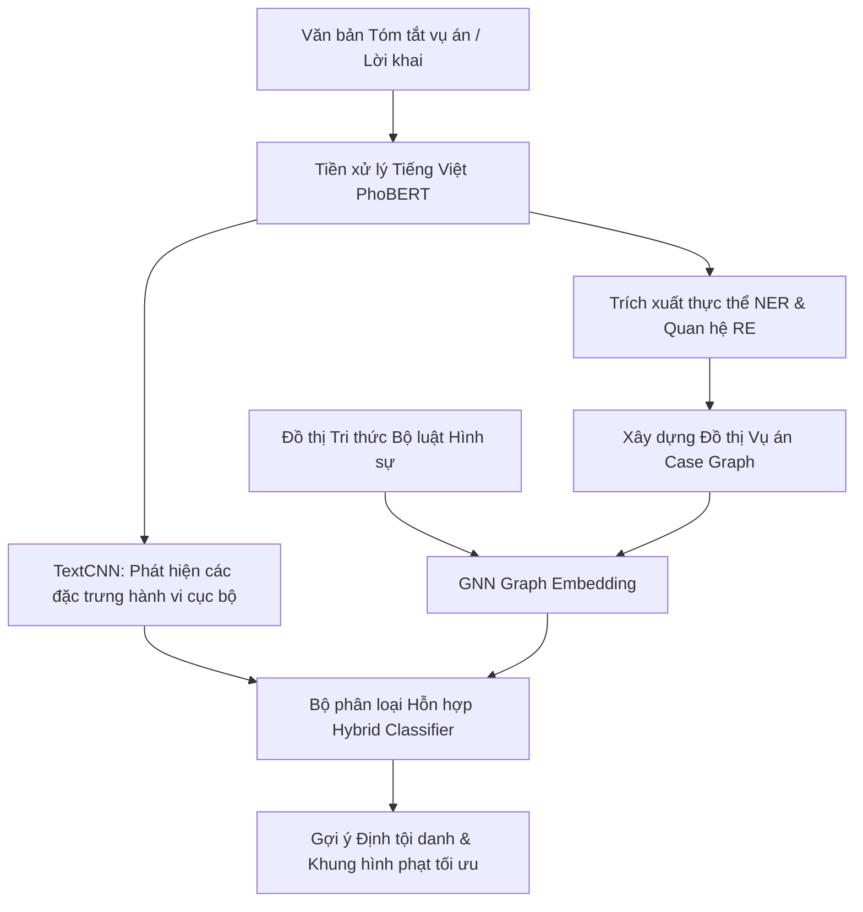
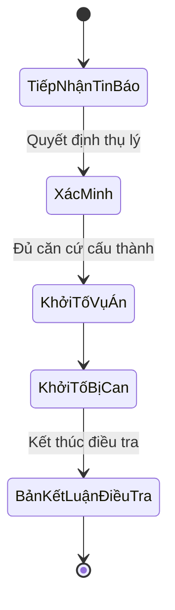

# Kế Hoạch Đề Xuất Cải Tiến Hệ Thống Định Tội Danh & Tố Tụng Hình Sự Thông Minh (Cập nhật)

Tài liệu này đề xuất phương án cải tiến công cụ **Đối chiếu & Đề xuất định tội** (Legal Match Engine) và toàn bộ nền tảng **Investigation Assistant**. Kế hoạch tập trung vào chuyển đổi mô hình định tội danh dựa trên **mạng nơ-ron học sâu (GNN và CNN)**, tái cấu trúc giao diện người dùng (UI/UX), bổ sung module quản lý tiến trình điều tra/hồ sơ, và tích hợp các chức năng hỗ trợ điều tra nâng cao.

---

## 1. Đánh Giá Hiện Trạng & Lý Do Cải Tiến

### 1.1. Hạn chế về Giải thuật đối sánh Luật
* **Trích lọc từ khóa tĩnh:** Đang sử dụng cơ chế so khớp từ khóa đơn giản trong [matching_engine.py](file:///Users/quochuy/QH_Code/Software/Investigation_Assistant/app/services/matching_engine.py) dễ dẫn đến bỏ sót hành vi khách quan do sự đa dạng về ngữ cảnh tiếng Việt (ví dụ: dùng từ đồng nghĩa như "cuỗm", "khoắng", "nẫng" thay vì "trộm cắp").
* **Thiếu phân tích cấu thành tội phạm:** Việc định tội danh chỉ dựa trên tần suất xuất hiện từ khóa mà không phân tích 4 yếu tố cấu thành tội phạm (*Chủ thể, Khách thể, Mặt chủ quan, Mặt khách quan*).

### 1.2. Hạn chế về Giao diện & Trải nghiệm Người dùng (UI/UX)
* **Lỗi hiển thị tương phản (Chữ/Chữ số màu trắng):** Một số màn hình hoặc component hiển thị chữ số hoặc trạng thái màu trắng trên nền sáng (hoặc ngược lại) gây khó khăn cho việc đọc thông tin của các điều tra viên.
* **Giao diện thiếu tính tương tác động:** Hệ thống báo cáo đối chiếu luật còn tĩnh, chưa có đồ thị trực quan hóa mối liên kết giữa hành vi trong vụ án và điều khoản luật.

### 1.3. Thiếu tính năng Quản lý Quá trình Điều tra & Cập nhật Hồ sơ
* **Hồ sơ vụ án tĩnh:** Hiện tại chưa có module cập nhật động nhật ký quá trình điều tra (Investigation Log), chưa thể hiện được tiến độ xử lý hồ sơ theo thời gian thực.
* **Thời hạn tố tụng chưa được liên kết:** Các mốc thời gian tố tụng hình sự (tạm giữ, tạm giam, thời hạn điều tra) chưa tự động đồng bộ khi cập nhật thông tin hồ sơ vụ án.

---

## 2. Đề Xuất Cải Tiến Giao Diện & Tối Ưu Hóa Trải Nghiệm (UI/UX Refactoring)

Chúng tôi đề xuất tái cấu trúc giao diện dựa trên hệ thống thiết kế cao cấp (Premium Design System) để giải quyết các lỗi hiện tại và tăng tính trực quan.

```diff
- Màu chữ số: Hiện tại sử dụng màu trắng trên nền xám nhạt/xanh nhạt gây lóa mắt, mất tương phản.
+ Giải pháp: Cập nhật hệ thống màu sắc HSL với độ tương phản chuẩn WCAG 2.1 (AA/AAA). Sử dụng chữ số màu đen/slate đậm trên nền sáng, hoặc chữ số màu trắng trên nền tối đậm (Dark Mode).
```

### Các cập nhật giao diện cụ thể:
* **Khắc phục lỗi hiển thị chữ số:** Kiểm tra toàn bộ mã nguồn CSS/Tailwind (ví dụ: [index.css](file:///Users/quochuy/QH_Code/Software/Investigation_Assistant/frontend/src/index.css)) để loại bỏ các class gây lỗi tương phản màu chữ (như kết hợp `.text-white` trên `.bg-slate-100`).
* **Bảng điều khiển Tiến độ Trực quan (Dossier Dashboard):** Thiết kế lại giao diện quản lý vụ án với các thẻ thông tin (cards) có màu sắc tương phản rõ rệt, hiển thị nhanh các thông tin định lượng quan trọng (Giá trị thiệt hại, Số lượng bị can, Thời hạn tố tụng còn lại).
* **Đồ thị đối chiếu Luật (Interactive Link Graph):** Sử dụng các thư viện như `D3.js` hoặc `React Flow` để biểu diễn đồ thị cấu thành tội phạm dưới dạng tương tác trực quan. Người dùng có thể click vào các kết nối để xem lý do AI liên kết hành vi vụ việc với điều luật hình sự.

---

## 3. Kiến Trúc Học Sâu Cho Định Tội Danh (GNN & CNN)



### 3.1. Phân loại hành vi cục bộ bằng mạng tích chập (CNN)
* Sử dụng lớp **CNN 1D** trượt qua các vector từ (Embeddings) để phát hiện các cụm từ hành vi cốt lõi (ví dụ: *"dùng vũ lực đe dọa"*, *"lợi dụng chức vụ quyền hạn"*, *"tiếp cận từ phía sau"*). CNN giúp bắt trọn ngữ cảnh cục bộ hiệu quả hơn so với chỉ quét từ khóa đơn lẻ.

### 3.2. Đối sánh cấu thành tội phạm bằng mạng nơ-ron đồ thị (GNN)
* **Case Graph:** Chuyển đổi vụ án thành các nút: `Suspect` (Bị can), `Victim` (Bị hại), `Action` (Hành vi), `Asset` (Tài sản), `Weapon` (Công cụ). Các nút được kết nối bởi các quan hệ như `THỰC_HIỆN`, `ĐE_DỌA`, `CHIẾM_ĐOẠT`.
* **Legal Graph:** Biểu diễn Bộ luật Hình sự dưới dạng đồ thị tri thức pháp lý.
* **So khớp:** Sử dụng **Graph Attention Network (GAT)** để học biểu diễn và dự đoán liên kết (Link Prediction) giữa vụ án thực tế và điều luật phù hợp nhất. Giải pháp này giúp điều tra viên biết rõ *tại sao* bị can bị định tội danh đó (qua các kết nối thực thể rõ ràng).

---

## 4. Module Quản Lý Tiến Trình Điều Tra & Hồ Sơ Động

Hệ thống sẽ được trang bị thêm bộ công cụ quản lý hồ sơ và tiến trình điều tra theo thời gian thực (Real-time Dossier Tracker):



### Các tính năng chính của Module:
1. **Dòng thời gian Điều tra Động (Dynamic Investigation Timeline):**
   * Cho phép điều tra viên ghi nhận nhật ký quá trình điều tra (ngày lấy lời khai, ngày thu thập vật chứng, ngày thực hiện thực nghiệm hiện trường).
   * Tự động sinh ra các mốc thời hạn tố tụng tiếp theo dựa trên quy định của Bộ luật Tố tụng Hình sự 2015 tương ứng với tội danh đang điều tra.
2. **Cập nhật & Đồng bộ Hồ sơ Thời gian thực:**
   * Cơ chế ghi nhận vết hoạt động (**Audit Trail**) ghi lại toàn bộ lịch sử chỉnh sửa hồ sơ vụ án: Ai đã cập nhật lời khai, thay đổi giá trị thiệt hại, hoặc thêm bị can mới.
   * Gửi cảnh báo tự động khi phát hiện hồ sơ bị chậm trễ tiến độ hoặc sắp hết thời hiệu điều tra theo luật định.

---

## 5. Tích Hợp Các Chức Năng Nâng Cao (Advanced Features)

Để phần mềm trở thành trợ lý đắc lực cho Cơ quan Điều tra, các chức năng nâng cao sau sẽ được tích hợp:

### 5.1. Truy tìm Vụ án tương tự (Semantic Case Retrieval)
* Huấn luyện mô hình Embedding biểu diễn hồ sơ vụ án thành các vector 768 chiều.
* Sử dụng **Cơ sở dữ liệu Vector (Vector Database)** như Milvus hoặc FAISS để thực hiện tìm kiếm tương đồng (Semantic Search). Khi điều tra viên nhập hồ sơ vụ án mới, hệ thống tự động tìm kiếm các vụ án trong lịch sử có cùng phương thức, thủ đoạn thực hiện (Modus Operandi) để tham khảo cách định tội và biện pháp xử lý.

### 5.2. Phân tích mâu thuẫn chứng cứ & lời khai (Contradiction Analyzer)
* Áp dụng mô hình ngôn ngữ lớn (LLM) hoặc bộ phân loại quan hệ văn bản (NLI - Natural Language Inference) để so khớp các bản tự khai của các bị can/nhân chứng khác nhau trong hồ sơ.
* Tự động phát hiện các điểm mâu thuẫn về mặt thời gian, địa điểm, hành vi (ví dụ: *Bị can A khai lúc 8h đang ở nhà, nhưng lời khai nhân chứng B lại khẳng định nhìn thấy A tại hiện trường lúc 8h*).

### 5.3. Gợi ý Kế hoạch Xác minh & Hỏi cung (AI Investigation Playbook)
* Dựa trên các tình tiết đã có trong hồ sơ vụ án và cấu thành tội danh đề xuất, AI sẽ phân tích các yếu tố chứng cứ còn thiếu (ví dụ: thiếu giám định thiệt hại tài sản, thiếu kết quả xét nghiệm nồng độ cồn/ma túy).
* Tự động tạo bản thảo **Kế hoạch hỏi cung bị can** với danh sách các câu hỏi gợi ý tập trung vào các điểm mâu thuẫn hoặc tình tiết cấu thành tội phạm chưa rõ ràng.

---

## 6. Kế Hoạch Triển Khai Chi Tiết (Cập nhật)

### Giai đoạn 1: Thiết kế UI/UX & Chuẩn hóa Dữ liệu (Tháng 1 - Tháng 2)
* **Tác vụ 1:** Sửa lỗi giao diện chữ số màu trắng tại màn hình [LegalMatch.tsx](file:///Users/quochuy/QH_Code/Software/Investigation_Assistant/frontend/src/views/LegalMatch.tsx), tối ưu hóa độ tương phản hệ thống màu sắc trong CSS.
* **Tác vụ 2:** Thiết kế cấu trúc cơ sở dữ liệu cho Module Tiến trình điều tra & Nhật ký hoạt động hồ sơ.
* **Tác vụ 3:** Xây dựng đồ thị tri thức pháp lý mẫu cho nhóm Tội phạm xâm phạm sở hữu.

### Giai đoạn 2: Phát triển Mô hình AI & Module Nghiệp vụ (Tháng 3 - Tháng 4)
* **Tác vụ 1:** Huấn luyện mô hình TextCNN phân loại tội danh và GNN so khớp cấu thành tội phạm.
* **Tác vụ 2:** Xây dựng tính năng Tìm kiếm vụ án tương đồng (Semantic Search) sử dụng Vector Database.
* **Tác vụ 3:** Phát triển Module Dòng thời gian tố tụng động và Cảnh báo thời hạn tự động.

### Giai đoạn 3: Tích hợp & Kiểm thử (Tháng 5)
* **Tác vụ 1:** Tích hợp API AI phân tích mâu thuẫn chứng cứ và gợi ý câu hỏi hỏi cung.
* **Tác vụ 2:** Triển khai thử nghiệm thực tế tại một số đơn vị điều tra giả lập để đánh giá độ chính xác và tính thực tiễn của giao diện mới.

---

## 7. Đề Xuất Phản Hồi Từ Người Dùng (Open Questions)

1. **Khắc phục giao diện:** Bạn có muốn chúng tôi tiến hành cập nhật trực tiếp mã nguồn CSS hiện tại để khắc phục ngay các vấn đề hiển thị chữ số màu trắng/kém tương phản không?
2. **Luồng nghiệp vụ tiến trình điều tra:** Bạn có tài liệu quy trình nội bộ/biểu mẫu về quá trình cập nhật hồ sơ và dòng thời gian điều tra thực tế để chúng tôi chuẩn hóa database không?
3. **Mức độ phức tạp của AI hỏi cung:** Chức năng gợi ý câu hỏi hỏi cung nên ở dạng sinh văn bản tự do (Generative AI) hay dựa trên các kịch bản câu hỏi có sẵn theo từng tội danh?
