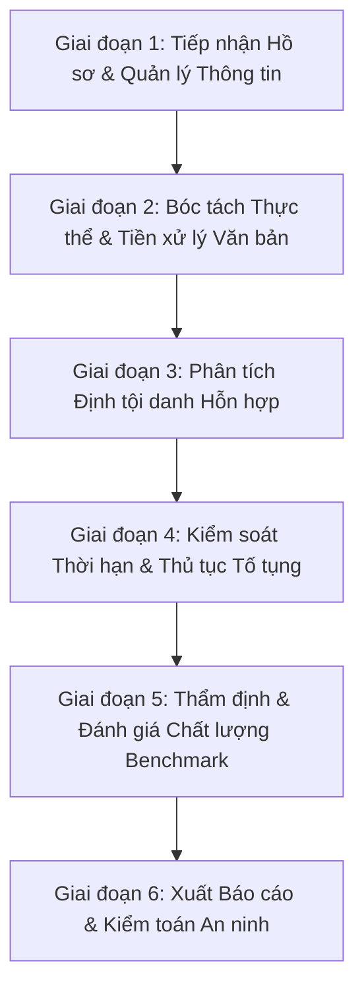

# QUY TRÌNH NGHIÊN CỨU & ĐIỀU TRA HÌNH SỰ - PPU INVESTIGATION ASSISTANT

Tài liệu này mô tả chi tiết toàn bộ kiến trúc, luồng dữ liệu, quy tắc logic pháp lý và quy trình nghiên cứu vụ án hình sự hiện có trên hệ thống **PPU Investigation Assistant**, giúp mô hình AI (Gemini) đọc hiểu và thực thi chính xác các nhiệm vụ phân tích, hỗ trợ điều tra.

---

## 1. TỔNG QUAN HỆ THỐNG (SYSTEM OVERVIEW)

- **Tên hệ thống:** PPU Investigation Assistant (Trợ lý Điều tra Hình sự PPU).
- **Mục tiêu:** Hỗ trợ Điều tra viên, Cán bộ tố tụng nghiên cứu hồ sơ vụ án hình sự, phân tích hành vi, định tội danh theo Bộ luật Hình sự 2015 (BLHS), kiểm soát thời hạn và thủ tục theo Bộ luật Tố tụng Hình sự 2015 (BLTTHS).
- **Môi trường vận hành:** Offline / Air-gapped 100% trong mạng nội bộ (LAN), bảo đảm an toàn dữ liệu tuyệt đối.
- **Công nghệ nền tảng:**
  - Backend: FastAPI (Python 3.10+), SQLAlchemy, PyMySQL, Pydantic v2.
  - Frontend: React 19, TypeScript, Vite, TailwindCSS v4, Zustand.
  - Database: MySQL (dữ liệu nghiệp vụ) + JSON Local Knowledge Graph (`legal_knowledge_graph.json`).
  - Phân tích AI: Local LLM Engine (Ollama/llama3/PhoBERT), Rule Matching Engine, GNN/Graph Knowledge Service.

---

## 2. QUY TRÌNH NGHIÊN CỨU & ĐIỀU TRA HÌNH SỰ (INVESTIGATION WORKFLOW)

Quy trình nghiên cứu vụ án trên hệ thống gồm **6 Giai đoạn chính**:



---

### GIAI ĐOẠN 1: TIẾP NHẬN HỒ SƠ & QUẢN LÝ THÔNG TIN (CASE INTAKE & INGESTION)

- **Mục tiêu:** Tạo lập vụ án (`CaseFile`), ghi nhận thông tin đối tượng (Bị can, Bị hại) và thu thập các tài liệu liên quan (lời khai, biên bản bắt, tài liệu chứng cứ).
- **Các thực thể dữ liệu chính:**
  - `CaseFile`: ID vụ án, Mã vụ án, Tên vụ án, Ngày xảy ra, Địa bàn, Tóm tắt hành vi (`summary_acts`), Trạng thái tố tụng (`DRAFT`, `INVESTIGATING`, `CLOSED`).
  - `Suspect`: Tên bị can, Ngày sinh, CCCD (được bảo vệ PII qua `MaskedText`), Tiền án/tiền sự, Tiền lương/chức vụ, Ngày bị bắt/tạm giữ (`arrest_time`).
  - `Victim`: Thông tin bị hại, thiệt hại tài sản/sức khỏe.
  - `CaseDocument`: Tệp biên bản, bản khai, quyết định tố tụng đính kèm.
- **Bảo mật PII & Audit Log:**
  - Dữ liệu nhạy cảm (CCCD, Họ tên bị can) được hiển thị mặc định dưới dạng che mờ `MaskedText` (ví dụ `035***891`).
  - Mọi thao tác xem CCCD (`VIEW_CCCD`) hoặc chỉnh sửa thông tin đều được `AuditLogger` tự động lưu vết gồm: Mã cán bộ, Địa chỉ IP, Hành động và Timestamp.

---

### GIAI ĐOẠN 2: BÓC TÁCH THỰC THỂ & TIỀN XỬ LÝ VĂN BẢN (ENTITY EXTRACTION)

- **Mục tiêu:** Tự động chuyển đổi văn bản tóm tắt tự do (`summary_acts`, bản khai) thành dữ liệu cấu trúc `ExtractedEntitiesSchema`.
- **Cơ chế bóc tách 2 lớp (Hybrid Pipeline):**
  1. **Lớp 1 - Primary (Local LLM Service):** Gửi prompt đến Local LLM (Ollama / Llama-3) yêu cầu trích xuất dữ liệu ra định dạng JSON chuẩn.
  2. **Lớp 2 - Fallback (Regex Parser Engine):** Tự động kích hoạt khi Local LLM offline hoặc gặp lỗi, sử dụng các biểu thức chính quy (Regex) tối ưu hóa cho văn bản pháp lý Tiếng Việt.
- **Các thực thể bóc tách cốt lõi:**
  - `suspect_age` (int): Độ tuổi của bị can tại thời điểm phạm tội.
  - `objective_behavior` (str): Mô tả hành vi khách quan cốt lõi (ví dụ: *"lén lút đột nhập cạy cửa lấy tài sản"*, *"dùng vũ lực khống chế"*, *"giả mạo giấy tờ"*).
  - `consequence` (float): Giá trị tài sản bị chiếm đoạt/xâm hại hoặc hậu quả tài chính (đơn vị: VNĐ).
  - `arrest_time` (str): Ngày bắt/tạm giữ của bị can (`YYYY-MM-DD`).
  - `weapon` (str): Phương tiện, công cụ, hung khí thực hiện hành vi.

---

### GIAI ĐOẠN 3: PHÂN TÍCH ĐỊNH TỘI DANH HỖN HỢP (HYBRID LEGAL MATCHING ENGINE)

- **Mục tiêu:** So khớp hành vi thực tế với quy định của Bộ luật Hình sự 2015 (sửa đổi 2017), đưa ra gợi ý Điều luật, Khoản áp dụng và cảnh báo xung đột/cạnh tranh tội danh.
- **Kiến trúc phân tích 3 tầng:**

#### Tầng 1: Động cơ Từ khóa & Ngưỡng tài sản (`matching_engine.py`)
- **Đánh giá Năng lực TNHS (Điều 12 BLHS):**
  - Tuổi $< 14$: Miễn trách nhiệm hình sự trong mọi trường hợp.
  - $14 \le \text{Tuổi} < 16$: Chỉ chịu TNHS với tội **Rất nghiêm trọng** hoặc **Đặc biệt nghiêm trọng** (ví dụ Điều 134, 168, 173, 174...). Nếu khung hình phạt thuộc Tội ít nghiêm trọng $\rightarrow$ Đề xuất miễn TNHS.
  - $\text{Tuổi} \ge 16$: Đủ năng lực chịu TNHS đầy đủ.
- **Phân loại Khoản theo Ngưỡng Định lượng Thiệt hại:**
  - *Điều 173 (Trộm cắp tài sản) & Điều 174 (Lừa đảo chiếm đoạt tài sản):*
    - Thiệt hại $< 2.000.000$ VNĐ: Đánh giá tình tiết tăng nặng/tái phạm để áp dụng Khoản 1 hoặc không đủ yếu tố định tội.
    - $2.000.000 \text{ VNĐ} \le \text{Thiệt hại} < 50.000.000 \text{ VNĐ} \rightarrow$ Khoản 1 (Hình phạt: Tù 06 tháng - 03 năm hoặc Cải tạo không giam giữ).
    - $50.000.000 \text{ VNĐ} \le \text{Thiệt hại} < 200.000.000 \text{ VNĐ} \rightarrow$ Khoản 2 (Hình phạt: Tù 02 năm - 07 năm).
    - $200.000.000 \text{ VNĐ} \le \text{Thiệt hại} < 500.000.000 \text{ VNĐ} \rightarrow$ Khoản 3 (Hình phạt: Tù 07 năm - 15 năm).
    - $\text{Thiệt hại} \ge 500.000.000 \text{ VNĐ} \rightarrow$ Khoản 4 (Hình phạt: Tù 12 năm - 20 năm / Chung thân).

#### Tầng 2: Đồ thị Tri thức Pháp luật & GNN (`gnn_service.py`)
- **Nguồn dữ liệu:** `legal_knowledge_graph.json` chứa các nút Đỉnh (`Article`, `Clause`, `Element`) và Cạnh quan hệ (`Constitutes`, `PenaltyThreshold`, `ConflictWith`).
- **Phát hiện Cạnh tranh Tội danh (Crime Competition Warning):**
  - Phân biệt *Tội cướp tài sản (Điều 168)* và *Tội cưỡng đoạt tài sản (Điều 170)* dựa trên tình tiết "đe dọa dùng vũ lực ngay tức khắc" hay "uy hiếp tinh thần".
  - Phát hiện dấu hiệu giao thoa giữa *Trộm cắp (Điều 173)* và *Lừa đảo (Điều 174)* / *Lạm dụng tín nhiệm (Điều 175)* khi bị can mượn tài sản rồi bỏ trốn.

#### Tầng 3: Lập luận Pháp lý Local LLM (`local_llm.py`)
- Tự động sinh văn bản căn cứ hình sự (`căn_cứ_hình_sự`) giải thích mối quan hệ giữa Hành vi khách quan, Hậu quả thiệt hại, Yếu tố lỗi và Điều luật áp dụng.

---

### GIAI ĐOẠN 4: KIỂM SOÁT THỜI HẠN & THỦ TỤC TỐ TỤNG (PROCEDURAL TIMELINE SUPERVISION)

- **Mục tiêu:** Tự động giám sát tính hợp pháp của các mốc thời gian tạm giữ, tạm giam theo Bộ luật Tố tụng Hình sự 2015 (`procedural_service.py`), phát hiện vi phạm và gửi cảnh báo đỏ cho Điều tra viên.

#### 1. Kiểm soát Thời hạn Tạm giữ (Điều 118 BLTTHS)
- Mốc tạm giữ ban đầu: **03 ngày**.
- Gia hạn lần 1: **+03 ngày** (tổng 06 ngày) - Yêu cầu Quyết định Gia hạn tạm giữ lần 1 phê chuẩn bởi VKS.
- Gia hạn lần 2: **+03 ngày** (tổng 09 ngày) - Yêu cầu Quyết định Gia hạn tạm giữ lần 2 phê chuẩn bởi VKS.
- **Mức độ cảnh báo (`severity`):**
  - `INFO`: Chưa có ngày bắt/tạm giữ trong hồ sơ.
  - `WARNING`: Đang tạm giữ ngày thứ 1-2, nhắc chuẩn bị thủ tục gia hạn.
  - `CRITICAL`: Quá 03 ngày không có gia hạn 1, quá 06 ngày không có gia hạn 2, hoặc vượt quá **09 ngày** (Vi phạm tố tụng nghiêm trọng).

#### 2. Kiểm soát Thời hạn Tạm giam Điều tra (Điều 119 & 173 BLTTHS)
Dựa vào mức độ nghiêm trọng của tội danh đề xuất:
- **Tội ít nghiêm trọng** (Hình phạt tối đa $\le 3$ năm tù): Tạm giam tối đa **02 tháng**.
- **Tội nghiêm trọng** (Hình phạt tối đa 3 - 7 năm tù): Tạm giam tối đa **03 tháng**.
- **Tội rất nghiêm trọng** (Hình phạt tối đa 7 - 15 năm tù): Tạm giam tối đa **04 tháng**.
- **Tội đặc biệt nghiêm trọng** (Hình phạt tối đa $> 15$ năm tù / Chung thân / Tử hình): Tạm giam tối đa **04 tháng** (có thể đề nghị gia hạn theo quy định riêng).

#### 3. Gợi ý Biện pháp Ngăn chặn (Preventive Measures)
Dựa trên nhân thân bị can và tính chất hành vi:
- *Tạm giam* (Điều 119): Áp dụng cho tội Rất/Đặc biệt nghiêm trọng hoặc bị can không có nơi cư trú rõ ràng, có nguy cơ bỏ trốn/tiêu hủy chứng cứ.
- *Cấm đi khỏi nơi cư trú / Bảo lĩnh / Đặt tiền* (Điều 121, 122, 123): Áp dụng cho tội ít nghiêm trọng, nhân thân tốt, khai báo trung thực.

---

### GIAI ĐOẠN 5: THẨM ĐỊNH & ĐÁNH GIÁ CHẤT LƯỢNG BENCHMARK (EVALUATION)

- **Mục tiêu:** Định kỳ chạy thẩm định độ chính xác của các thuật toán phân tích qua module `app/api/evaluation.py`.
- **Bộ chỉ số đánh giá:**
  - **Precision:** Tỷ lệ tội danh đề xuất chính xác trên tổng số tội danh gợi ý.
  - **Recall:** Tỷ lệ phát hiện đúng tội danh thực tế trong bộ test case.
  - **F1-Score:** Điểm trung bình hài hòa giữa Precision và Recall.
  - **Procedural Accuracy Rate:** Tỷ lệ phát hiện chính xác các cảnh báo vi phạm thủ tục tố tụng.

---

### GIAI ĐOẠN 6: XUẤT BÁO CÁO & KIỂM TOÁN AN NINH (REPORTING & AUDIT TRAIL)

- **Kết xuất Báo cáo:** Tạo Báo cáo Trợ lý Điều tra (PDF/Bản in) gồm Tóm tắt vụ việc, Thực thể bóc tách, Tội danh đề xuất, Căn cứ pháp lý và Danh mục Cảnh báo Tố tụng.
- **Kiểm toán an ninh:**
  - Lưu nhật ký toàn bộ hành động (`ANALYZE_CASE`, `VIEW_CASE`, `VIEW_CCCD`, `LOGIN`) vào bảng `audit_logs`.
  - Màn hình giao diện tích hợp `SecurityWatermark` đè IP LAN, Tên cán bộ và Timestamp thời gian thực để bảo đảm không rò rỉ dữ liệu.

---

## 3. CẤU TRÚC DỮ LIỆU DÀNH CHO GEMINI / LLM (DATA SCHEMAS FOR LLM)

Khi Gemini tham gia xử lý các request hoặc hỗ trợ hệ thống, Gemini **PHẢI** tuân thủ đúng định dạng Pydantic Schemas bên dưới:

### Input Payload (`CaseAnalysisRequest`)
```json
{
  "case_id": 101,
  "summary_acts": "Ngày 15/08/2026, Nguyễn Văn A (17 tuổi) đột nhập vào nhà ông B lén lút lấy trộm 1 xe máy trị giá 60.000.000 VNĐ. Sau đó bị công an bắt giữ vào ngày 16/08/2026."
}
```

### Output Response (`CaseAnalysisResponse`)
```json
{
  "case_id": 101,
  "extracted_entities": {
    "suspect_age": 17,
    "objective_behavior": "lén lút đột nhập cạy cửa lấy trộm tài sản",
    "consequence": 60000000.0,
    "arrest_time": "2026-08-16",
    "weapon": "kìm cạy cửa"
  },
  "tội_danh_đề_xuất": [
    {
      "article_id": 173,
      "title": "Tội trộm cắp tài sản",
      "applicable_clause": 2,
      "clause_details": "Khoản 2 Điều 173: Chiếm đoạt tài sản trị giá từ 50.000.000 đồng đến dưới 200.000.000 đồng (Khung hình phạt: Tù từ 02 năm đến 07 năm).",
      "conflict_warning": null
    }
  ],
  "căn_cứ_hình_sự": "Căn cứ vào hành vi khách quan bóc tách được (lén lút đột nhập cạy cửa lấy trộm tài sản), thiệt hại tài sản tương ứng (60.000.000 VNĐ) đối chiếu với Khoản 2 Điều 173 Bộ luật Hình sự 2015. Bị can 17 tuổi đủ năng lực chịu TNHS theo Điều 12 BLHS.",
  "cảnh_báo_thủ_tục_tố_tụng": [
    {
      "severity": "WARNING",
      "message": "Bị can đang bị tạm giữ ngày thứ 2. Chuẩn bị hồ sơ trình VKS phê chuẩn Quyết định gia hạn tạm giữ lần 1 hoặc Quyết định khởi tố bị can.",
      "article_reference": "Điều 118 BLTTHS"
    }
  ]
}
```

---

## 4. HƯỚNG DẪN NGUYÊN TẮC CHO GEMINI KHI THỰC THI (GEMINI OPERATIONAL RULES)

1. **Tuân thủ Tuyệt đối Pháp luật Việt Nam:**
   - Dẫn chiếu chính xác theo **Bộ luật Hình sự 2015 (Sửa đổi, bổ sung 2017)** và **Bộ luật Tố tụng Hình sự 2015**.
   - Không tự đưa ra khung hình phạt hoặc quy trình không dựa trên các văn bản pháp luật hiện hành.

2. **Quy trình Suy luận Pháp lý 4 Bước:**
   - **Bước 1:** Kiểm tra độ tuổi bị can theo Điều 12 BLHS để xác định Năng lực chịu TNHS.
   - **Bước 2:** Bóc tách hành vi khách quan và giá trị thiệt hại định lượng để chọn đúng **Điều** và **Khoản** của BLHS.
   - **Bước 3:** Kiểm tra cạnh tranh tội danh (ví dụ Trộm cắp vs Lừa đảo vs Cướp/Cưỡng đoạt).
   - **Bước 4:** Tính toán thời gian tạm giữ/tạm giam (`ngày hiện tại - arrest_time`) đối chiếu với Điều 118 & 119 BLTTHS để đưa ra Cảnh báo Tố tụng.

3. **Định dạng dữ liệu & Bảo mật:**
   - Luôn duy trì định dạng JSON hợp lệ khi trả kết quả cho backend API.
   - Không làm rò rỉ dữ liệu PII hoặc thông tin cán bộ ngoài phạm vi kiểm toán an ninh.
