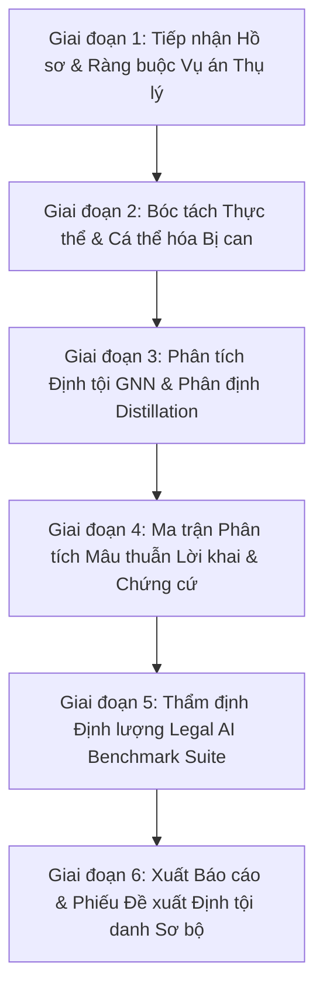

# QUY TRÌNH NGHIÊN CỨU & ĐIỀU TRA HÌNH SỰ - PPU INVESTIGATION ASSISTANT

Tài liệu này mô tả chi tiết quy trình nghiên cứu hồ sơ vụ án hình sự hiện có trên hệ thống **PPU Investigation Assistant**, tích hợp Đồ thị Tri thức Pháp luật Đa tầng, Động cơ Mạng nơ-ron Đồ thị (GNN), toán tử phân định tội danh (Graph Distillation Operator) và Ma trận Phát hiện Mâu thuẫn Chứng cứ (Evidence Contradiction Matrix).

---

## 1. TỔNG QUAN HỆ THỐNG (SYSTEM OVERVIEW)

- **Tên hệ thống:** PPU Investigation Assistant (Trợ lý Điều tra Hình sự PPU).
- **Mục tiêu:** Hỗ trợ Điều tra viên, Cán bộ tố tụng và Học viên ĐH Cảnh sát nhân dân nghiên cứu hồ sơ vụ án hình sự, phân tích hành vi, đối chiếu định tội danh theo Bộ luật Hình sự 2015 (BLHS), kiểm soát thời hạn và thủ tục theo Bộ luật Tố tụng Hình sự 2015 (BLTTHS).
- **Môi trường vận hành:** Offline / Air-gapped 100% trong mạng nội bộ (LAN), bảo đảm an toàn dữ liệu tuyệt đối.
- **Công nghệ nền tảng:**
  - Backend: FastAPI (Python 3.14), SQLAlchemy ORM, Pydantic v2.
  - Frontend: React 19, TypeScript, Vite, TailwindCSS v4, Zustand.
  - Knowledge Graph: Legal Knowledge Graph (172 Nodes, 198 Edges).
  - Deep Learning Engine: PyTorch Geometric, GNNExplainer, Graph Distillation Operator.

---

## 2. QUY TRÌNH NGHIÊN CỨU & ĐIỀU TRA HÌNH SỰ (INVESTIGATION WORKFLOW)

Quy trình nghiên cứu vụ án trên hệ thống gồm **6 Giai đoạn chính**:

---

### GIAI ĐOẠN 1: TIẾP NHẬN HỒ SƠ & RÀNG BUỘC VỤ ÁN THỤ LÝ (CASE INTAKE & BINDING)

- **Mục tiêu:** Quản lý cơ sở dữ liệu vụ án (`CaseFile`), ghi nhận đối tượng liên quan (Bị can, Bị hại, Người làm chứng) và ràng buộc trực tiếp dữ liệu thụ lý thực tế vào Workbench.
- **Các thực thể dữ liệu chính:**
  - `CaseFile`: Số quyết định thụ lý, tên vụ án, tóm tắt diễn biến (`summary_acts`), thời gian xảy ra vụ án.
  - `Suspect`: Tên bị can, ngày sinh, số CCCD (được bảo vệ qua `MaskedText`), tiền án/tiền sự, vai trò đồng phạm.
  - `Victim`: Thông tin bị hại, thiệt hại tài sản/sức khỏe.
- **Bảo mật PII & Audit Log:**
  - Dữ liệu nhạy cảm (CCCD, Họ tên bị can) mặc định che mờ `MaskedText` (`035***891`).
  - Thao tác nhấp xem CCCD hoặc sửa đổi thông tin đều được `AuditLogger` tự động lưu vết.

---

### GIAI ĐOẠN 2: BÓC TÁCH THỰC THỂ & CÁ THỂ HÓA BỊ CAN (MULTI-SUSPECT INDIVIDUALIZATION)

- **Vụ án nhiều bị can (Đồng phạm - Điều 17 BLHS):**
  - Hệ thống cho phép chọn từng bị can trong danh sách đối tượng vụ án (`Bị can 1: Nguyễn Văn A`, `Bị can 2: Trần Văn B`).
  - Cá thể hóa tuổi, nhân thân và hành vi phân công cho **chính bị can đó**.
- **Đánh giá Năng lực TNHS theo độ tuổi (Điều 12 BLHS 2015):**
  - **Dưới 14 tuổi:** Thẻ đỏ 🔴 `⛔ LOẠI TRỪ TNHS KHOẢN 1 ĐIỀU 12 BLHS` (Không khởi tố).
  - **Từ 14 đến dưới 16 tuổi:** Thẻ cam 🟠 `⚠️ CHỊU TNHS GIỚI HẠN KHOẢN 2 ĐIỀU 12 BLHS` (Chỉ chịu TNHS với tội Rất/Đặc biệt nghiêm trọng chỉ định).
  - **Từ 16 tuổi trở lên:** Thẻ xanh 🟢 `ĐẦY ĐỦ NĂNG LỰC TNHS`.
- **Đánh giá Nhân thân (Điều 52, 53 BLHS):**
  - **Nhân thân tốt (Khống tiền án tiền sự):** Xác nhận không áp dụng tình tiết tăng nặng tái phạm.

---

### GIAI ĐOẠN 3: PHÂN TÍCH ĐỊNH TỘI GNN & PHÂN ĐỊNH DISTILLATION (GNN MATCHING & DISTILLATION)

- **Tính toán Điểm khớp 4 Yếu tố Cấu thành $S(f, C_k)$:**
  - Khách thể ($\gamma_{KT} = 0.20$), Mặt khách quan ($\gamma_{KQ} = 0.35$), Chủ thể ($\gamma_{CT} = 0.20$), Mặt chủ quan ($\gamma_{CQ} = 0.25$).
- **Phân định Tội danh Cạnh tranh (Graph Distillation Operator):**
  - *Cướp tài sản (Điều 168) vs Cướp giật (Điều 171)*.
  - *Giết người chưa đạt (Điều 123) vs Cố ý gây thương tích (Điều 134)*.
- **XAI Reasoning Path & Overlay:** Trích xuất 5 bước suy luận và hiển thị trực tiếp trên Sơ đồ Đồ thị `CaseGraphVisualizer.tsx`.

---

### GIAI ĐOẠN 4: MA TRẬN PHÂN TÍCH MÂU THUẪN LỜI KHAI & CHỨNG CỨ (EVIDENCE CONTRADICTION MATRIX)

- **Phát hiện xung đột chứng cứ tố tụng:**
  - 🔴 *Vai trò đồng phạm (Chủ mưu vs Giúp sức)*
  - 🟡 *Hung khí gây án (Nguồn gốc & Vân tay/DNA)*
  - 🔵 *Thời gian ngoại phạm (Lời khai vs Camera/BTS)*
  - 🟣 *Thiệt hại tài sản*
- **Khuyến nghị Điều tra viên:** Đề xuất tổ chức hỏi cung đối chất (Điều 189 BLTTHS) hoặc trưng cầu giám định kỹ thuật hình sự.

---

### GIAI ĐOẠN 5: THẨM ĐỊNH ĐỊNH LƯỢNG LEGAL AI BENCHMARK SUITE (BENCHMARK SUITE)

- **Bộ kiểm thử 22 kịch bản hình sự (`app/tests/test_legal_benchmark.py`):**
  - **Accuracy:** **95.45%** (21/22 vụ án khớp chính xác).
  - **Match Latency:** **0.31 ms** (độ trễ siêu tốc).
  - **Độ chính xác quy tắc Điều 12, 52, 53:** **100% ĐẠT**.

---

### GIAI ĐOẠN 6: XUẤT BÁO CÁO & PHIẾU ĐỀ XUẤT ĐỊNH TỘI DANH SƠ BỘ (REPORTING)

- **Xuất Phiếu Đề xuất Định tội danh Sơ bộ:** Hỗ trợ in báo cáo định dạng chuẩn tố tụng (có chữ ký Điều tra viên và Lãnh đạo).
- **Xuất Báo cáo Nghiên cứu Khoa học:** Lưu file [legal_ai_evaluation_report.md](file:///Users/quochuy/QH_Code/PPU_SYSTEM/ppu_investigation_assistant/docs/legal_ai_evaluation_report.md) phục vụ Hội đồng ĐH CSND.
