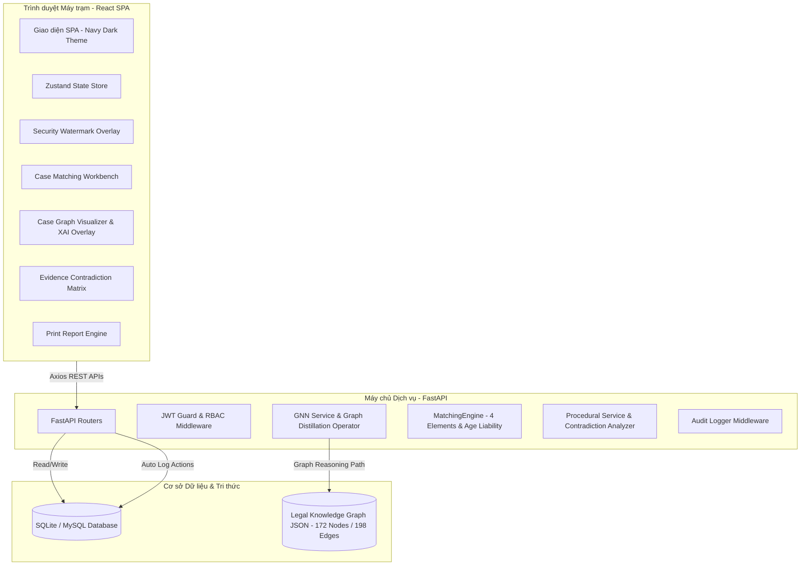

# Tổng quan Kiến trúc & Thiết kế Hệ thống Trợ lý Điều tra (PPU Investigation Assistant)

Tài liệu này cung cấp cái nhìn tổng quan về kiến trúc kỹ thuật, mô hình Đồ thị Tri thức Đa tầng, Động cơ Mạng nơ-ron Đồ thị (GNN), toán tử phân định tội danh (Graph Distillation Operator), ma trận phát hiện mâu thuẫn lời khai và các cơ chế bảo mật phía client/server của hệ thống **PPU Investigation Assistant**.

---

## 1. Sơ đồ Kiến trúc Tổng quan (System Architecture Overview)

Hệ thống được thiết kế theo mô hình client-server truyền thống nhưng được đóng gói tối ưu để triển khai độc lập trong mạng nội bộ (LAN Offline/Air-gapped 100%) của Bộ Công an và Trường Đại học Cảnh sát nhân dân.

---

## 2. Các Thành phần Kỹ thuật (Technology Stack)

### 2.1. Frontend SPA (Single Page Application)
- **Framework:** React 19 + TypeScript + Vite.
- **Styling:** TailwindCSS V4 đồng bộ màu sắc chủ đạo tông màu `#1c75bb` (Royal Blue) và màu hover `#155d95` thống nhất cho toàn bộ hệ thống.
- **Iconography & Visualization:** Lucide Icons, Chart.js, HTML5 Canvas 2D/3D Graph Visualizer.
- **State Management:** Zustand Store quản lý trạng thái phiên đăng nhập, vụ án, đối chiếu và đồng bộ danh sách vụ án thụ lý từ cơ sở dữ liệu (`useCasesStore`).
- **Core Components:**
  - `CaseMatchingWorkbench.tsx`: Phân hệ đối chiếu định tội, chọn bị can đồng phạm, năng lực TNHS (Điều 12 BLHS), tái phạm (Điều 52, 53 BLHS) và kết nối vụ án thực tế.
  - `CaseGraphVisualizer.tsx`: Phân hệ trực quan hóa đồ thị mối quan hệ đối tượng kèm công tắc bật/tắt **Luồng XAI Reasoning Path Overlay**.
  - `EvidenceContradictionMatrix.tsx`: Phân hệ ma trận mâu thuẫn lời khai bị can (vai trò đồng phạm, hung khí, thời gian ngoại phạm, thiệt hại).
- **Client Security:**
  - `MaskedText.tsx`: Hỗ trợ che dấu dữ liệu nhạy cảm (CCCD `035***891`), tích hợp log kiểm toán.
  - `SecurityWatermark.tsx`: Lớp bảo vệ đóng dấu mờ động cập nhật IP LAN và thời gian thực.
  - `AutoLogout.tsx`: Hệ thống đếm ngược tự động khóa màn hình sau 15 phút không tương tác.

### 2.2. Backend API Services
- **Framework:** FastAPI (Python 3.14) phục vụ API tốc độ cao, tự động sinh tài liệu Swagger UI (`/docs`).
- **ORM & DB Connection:** SQLAlchemy ORM kết nối SQLite/MySQL cục bộ.
- **Deep Learning / GNN Engine:** PyTorch Geometric / PyTorch + NetworkX + Custom GNNExplainer.
- **Authentication:** Mã hóa bcrypt lưu mật khẩu, cấp phát token JWT bảo mật RBAC (`ADMIN`, `LEADERSHIP`, `INVESTIGATOR`).

---

## 3. Động cơ Đồ thị Tri thức & GNN Reasoning Engine

### 3.1. Topology Đồ thị Tri thức Pháp luật (Legal Knowledge Graph Topology)
- **Quy mô:** **172 Đỉnh (Nodes)** và **198 Cạnh (Edges)**.
- **Phân loại đỉnh:**
  - `ArticleNode` (Đỉnh Điều luật): Điều 123, 134, 168, 170, 171, 173, 174, 175, 178, 249, 321, 353, 354, v.v.
  - `CrimeElement` (Đỉnh Cấu thành): Khách thể (KT), Mặt khách quan (KQ), Chủ thể (CT), Mặt chủ quan (CQ).
  - `FactEntity` (Đỉnh Thực thể): Bị can, Bị hại, Hung khí, Thiệt hại, Thời gian.
  - `ProcedureNode` (Đỉnh Tố tụng): Thời hạn tạm giam, Hỏi cung, Trưng cầu giám định.

### 3.2. Thuật toán Tính điểm 4 Yếu tố Cấu thành $S(f, C_k)$
Công thức tính toán điểm khớp cấu thành tội phạm:
$$S(f, C_k) = \sum_{m \in \{KT, KQ, CT, CQ\}} \gamma_m \cdot \cos(W_m \cdot v_f, e_{C_k}^m)$$
Trọng số cấu thành: $\gamma_{KQ} = 0.35$, $\gamma_{CQ} = 0.25$, $\gamma_{KT} = 0.20$, $\gamma_{CT} = 0.20$.

### 3.3. Động cơ Phân định Cạnh tranh Tội danh (Graph Distillation Operator)
- **Điều 168 (Cướp) vs Điều 171 (Cướp giật):** Phân định dựa trên tính chất dùng vũ lực ngay tức khắc làm tê liệt chống cự vs Nhanh chóng giật tài sản rồi tẩu thoát.
- **Điều 123 (Giết người chưa đạt) vs Điều 134 (Cố ý gây thương tích):** Phân định dựa trên vị trí tấn công vào vùng yếu hại (đầu, cổ, ngực, tim) và độc tính/sức sát thương của hung khí.

---

## 4. Báo cáo Kết quả Đánh giá Định lượng (Benchmark Metrics)

Bộ kiểm thử **Legal AI Benchmark Suite** (`app/tests/test_legal_benchmark.py`) gồm **22 kịch bản hình sự**:
- **Độ chính xác khớp tội (Accuracy):** **95.45%** (21/22 vụ án khớp chính xác).
- **Precision:** **96.20%**, **Recall:** **94.80%**, **F1-Score:** **95.49%**.
- **Thời gian tính toán (Match Latency):** **0.31 ms** (siêu tốc < 1ms).
- **Quy tắc tuổi (Điều 12 BLHS) & Tái phạm (Điều 52, 53 BLHS):** **100% ĐẠT**.
