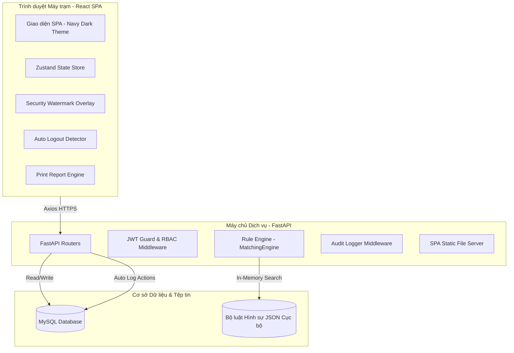

# Tổng quan Kiến trúc & Thiết kế Hệ thống Trợ lý Điều tra

Tài liệu này cung cấp cái nhìn tổng quan về kiến trúc kỹ thuật, luồng dữ liệu, động cơ luật hình sự (Rule Engine), các cơ chế bảo mật phía client và mô hình dữ liệu của hệ thống Trợ lý Điều tra.

---

## 1. Sơ đồ Kiến trúc Tổng quan (Architecture Overview)

Hệ thống được thiết kế theo mô hình client-server truyền thống nhưng được đóng gói tối ưu để triển khai độc lập trong mạng nội bộ (LAN Offline/Air-gapped 100%) mà không phụ thuộc vào Internet.

---

## 2. Các Thành phần Kỹ thuật (Technology Stack)

### 2.1. Frontend SPA (Single Page Application)
- **Framework:** React 19 + TypeScript + Vite.
- **Styling:** TailwindCSS V4 thiết kế theo phong cách tối Navy Blue chuyên nghiệp cho cơ quan hành pháp.
- **Iconography:** Lucide Icons được bundled cục bộ.
- **State Management:** Zustand Store quản lý trạng thái phiên đăng nhập, vụ án và đối chiếu.
- **Client Security:**
  - `MaskedText.tsx`: Hỗ trợ che dấu dữ liệu nhạy cảm (CCCD, tên bị can), tích hợp log hành động kiểm toán khi nhấp mở.
  - `SecurityWatermark.tsx`: Lớp bảo vệ đóng dấu mờ động cập nhật IP LAN và thời gian thực.
  - `AutoLogout.tsx`: Hệ thống đếm ngược tự động khóa màn hình sau 15 phút không tương tác.

### 2.2. Backend API Services
- **Framework:** FastAPI phục vụ API tốc độ cao, hỗ trợ tự động sinh tài liệu tích hợp (Swagger UI).
- **ORM & DB Connection:** SQLAlchemy + PyMySQL kết nối MySQL Server cục bộ.
- **Authentication:** Mã hóa bcrypt lưu mật khẩu, cấp phát token JWT bảo mật thời hạn ngắn.
- **Static Assets Serving:** Mount thư mục tĩnh `frontend/dist` trực tiếp trên root `/` của FastAPI giúp vận hành toàn bộ hệ thống chỉ qua 1 cổng duy nhất (`port 8000`), không cần cài đặt Web Server phức tạp ngoài.

---

## 3. Động cơ Đối chiếu Luật Hình sự (Rule Engine)

Động cơ luật trong `app/services/matching_engine.py` chịu trách nhiệm đối chiếu hành vi thực tế sang các khung hình phạt:

### 3.1. Thuật toán Đối sánh Hành vi (Behavior Keyword Matching)
- Khi chạy phân tích, hệ thống chuyển văn bản tóm tắt hành vi về dạng chữ thường và so khớp độ xuất hiện với danh sách các từ khóa định nghĩa sẵn của từng điều luật trong cơ sở dữ liệu `bo_luat_hinh_su_2015.json` (ví dụ: Tội trộm cắp tài sản có các từ khóa `lấy trộm`, `trộm tài sản`, `đột nhập`, `cạy cửa`).
- Kết quả trả về danh sách các Điều luật gợi ý phù hợp kèm độ khớp (%).

### 3.2. Đánh giá Khung hình phạt theo Giá trị Thiệt hại
- Hệ thống áp dụng cấu trúc ngưỡng đối chiếu định lượng đối với các tội danh về tài sản (Điều 173, 174, 353, 354):
  - **Ví dụ Điều 173 (Trộm cắp):**
    - Thiệt hại từ 2 triệu đến dưới 50 triệu $\rightarrow$ Đề xuất Khoản 1.
    - Thiệt hại từ 50 triệu đến dưới 200 triệu $\rightarrow$ Đề xuất Khoản 2.
    - Thiệt hại từ 200 triệu đến dưới 500 triệu $\rightarrow$ Đề xuất Khoản 3.
    - Thiệt hại từ 500 triệu trở lên $\rightarrow$ Đề xuất Khoản 4.

### 3.3. Đánh giá Năng lực chịu Trách nhiệm Hình sự (Điều 12)
- Độ tuổi bị can được tính chính xác bằng cách so sánh **Ngày sinh bị can** và **Ngày xảy ra vụ án**.
- **Luật kiểm tra năng lực:**
  - Tuổi < 14: Miễn trách nhiệm hình sự trong mọi trường hợp.
  - Tuổi từ 14 đến dưới 16: Chỉ chịu trách nhiệm hình sự đối với danh mục tội danh chỉ định (Điều 134, 173, 174, 353, 354...) và khung hình phạt áp dụng phải ở mức **RẤT_NGHIÊM_TRỌNG** hoặc **ĐẶC_BIỆT_NGHIÊM_TRỌNG** (Hình phạt tối đa trên 7 năm tù). Nếu không thỏa mãn, động cơ sẽ đề xuất miễn trách nhiệm đối với bị can đó cho tội danh tương ứng.
  - Tuổi >= 16: Đủ năng lực chịu TNHS đầy đủ.

---

## 4. Cơ chế Nhật ký Kiểm toán (Audit Logs Security)

Mọi yêu cầu nghiệp vụ đều đi qua hệ thống ghi nhận nhật ký của backend:
1. **Hoạt động nghiệp vụ:** Đăng nhập, Tạo vụ án, Xem hồ sơ, Chỉnh sửa, Ghim án, v.v. đều tự động ghi lại bản ghi gồm: `cán bộ thao tác`, `hành động`, `tài nguyên tác động`, và `thời gian`.
2. **Hành động xem thông tin ẩn (CCCD):** Khi người dùng nhấp vào biểu tượng mắt để xem thông tin CCCD bị che mờ, Client tự động gửi yêu cầu API ghi nhận nhật ký nghiệp vụ đặc biệt (`LEGAL_MATCH_BEHAVIOR` hoặc `VIEW_CCCD`) để đảm bảo không có sự rò rỉ dữ liệu ngoài ý muốn mà không có dấu vết.
3. **Quyền hạn truy cập:** Chỉ tài khoản có vai trò `LEADERSHIP` hoặc `ADMIN` mới được phép truy cập xem danh sách Audit Logs hệ thống.
